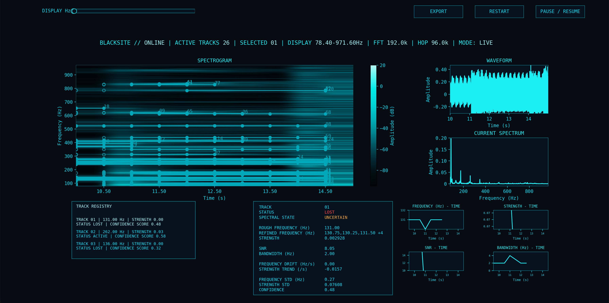

# BLACKSITE v1.0

**Persistent spectral tracking and signal-analysis workstation**

**Created by:** penguinoffline

> Status: **v1.0.0 released. The macOS and Windows applications have been built and manually tested, and the automated validation suite passes on both platforms.**

<p align="center">
  
</p>

<p align="center">
  
</p>

BLACKSITE is built to be a Python signal analysis and persistent spectral tracking workstation. v1.0 is intentionally an **offline/replay system** by design: it loads prerecorded CSV or WAV data, replays it progressively like a live source, detects peaks, maintains track identity through time, refines frequency structure, calculates signal metrics, and then presents everything in one operator dashboard.

The most special part of this tool is its tracking. BLACKSITE is not just detecting **peaks in an FFT frame**. It tries to show **if the same signal was seen before, what changed, whether it disappeared, and whether it came back.**

## Short introduction to me (skip this if you're only interested in the project :c)

**22 Sep. 2026**

Hiya :D!! My name is penguinoffline (aka. Pingura) and I have just started my university journey in Mechanical and Electrical engineering about 2 days ago (scaaary).
Over the summer, I was practically disabled after a shoulder surgery because MMA isn't the nicest of sports. So, out of boredom, I decided to teach myself Python and took on this massive project.
After grinding 7hrs a day (still am), I'm **VERY** excited to present to you (the 2 people viewing this) **BLACKSITE** v1.0!!!! (HIP HIP HOORAYYY :D). I've packaged BLACKSITE so that you can download the application on both Windows and Mac.
I will now be switching my tone into a more professional one to walk you through everything about this project.

Before signing off, I'd like to genuinely thank you for taking an interest in BLACKSITE and potentially even using it.
Better and more exciting things will be coming along in the future where firmware will eventually be incorporated (ouuuuu).

Thanks for reading :)

<em>&#126;Pingura out&#126;</em>

## What v1.0 does

- simulated live replay from prerecorded data
- short window FFT for rough detection and longer window for frequency refinement
- persistent track IDs
- **CANDIDATE -> ACTIVE -> COASTING -> LOST -> TERMINATED** lifecycle processing
- LOST track reacquisition before being terminated
- refined spectral states: **INDIVIDUAL**, **BLENDED**, and **UNCERTAIN**
- signal strength, SNR, bandwidth, frequency drift, strength trend, stability, and confidence
- rolling waveform, spectrum, spectrogram, track registry, telemetry, and track history
- clickable and scrollable track selection, pause and resume, restart, display frequency slider, and end of file state
- summary and track history CSV export
- CSV and uncompressed PCM WAV input that fits the requirements
- incremental processing and bounded display rendering for better performance

## Download BLACKSITE

If you just want to use BLACKSITE without setting up Python, packaged applications are available for:

- macOS
- Windows

You can find both in the GitHub Release.

## My core pipeline

```text
INPUT
  -> rolling buffer
  -> short FFT + long FFT
  -> peak detection
  -> persistent rough frequency tracking
  -> lifecycle
  -> frequency refinement
  -> persistence + spectral state analysis
  -> track histories + signal metrics
  -> dashboard + CSV export
```

A more detailed architecture description is in [`docs/ARCHITECTURE.md`](docs/ARCHITECTURE.md).

## My definition of analysis time

v1.0 defines analysis time in seconds so sample sizes scale with the input sample rate:

| Stage | Duration |
|---|---:|
| Short analysis window | 1.0s |
| Long refinement window | 4.0s |
| Hop | 0.5s |
| Rolling buffer | 5.0s |
| Main GUI update timer | 500ms |

For example, at 48 kHz the short FFT uses 48,000 samples, the long FFT uses 192,000 samples, and the hop is 24,000 samples.

## Supported input

### CSV

BLACKSITE needs exactly one recognized time column and one recognized signal column. It accepts comma, semicolon, or tab delimiters. Time may be specified in seconds, milliseconds, microseconds, or nanoseconds through the column header (unitless time columns are treated as seconds).

Please make sure your CSV contains finite numeric values, strictly increasing timestamps, approximately uniform spacing, and at least one second of data. v1.0 rejects timestamp spacing that differs by more than approximately 1% from the median spacing.

### WAV

v1.0 supports **uncompressed PCM WAV** with:

- 8-bit PCM
- 16-bit PCM
- 24-bit PCM
- 32-bit PCM
- mono or multichannel input

Multichannel WAV input is averaged to mono for analysis. Please make sure your input is at least one second long.

See [`docs/INPUT_REQUIREMENTS.md`](docs/INPUT_REQUIREMENTS.md) for the full list of requirements.

## If you would like to run from the source

v1.0 has been developed and tested with Python 3.13.5 on macOS. The automated test suite also passes on Windows with Python 3.13. Here are the dependencies you will need to install:

```bash
python3 -m pip install -r requirements.txt
```

BLACKSITE uses Matplotlib's Qt backend with PyQt5 for the interface.

Run:

```bash
python3 BLACKSITE_v1.0.py
```

The launcher lets you select a supported CSV or WAV file and opens the dashboard after validation.

## Dashboard controls

- **BROWSE / LAUNCH** — select and load an input file
- **PAUSE / RESUME** — stop or continue
- **RESTART** — restart analysis from the beginning of the recording
- **DISPLAY Hz** — change the visible frequency range on graphs without changing the measurement data
- **Track Registry** — scroll through accepted tracks and click a track to inspect its telemetry and history
- **EXPORT** — write paired summary and history CSV output at the time of export

At the end of replay, BLACKSITE enters **FINISHED** while keeping the final analysis visible.

## Track lifecycle I defined

A new detection begins as **CANDIDATE**. Repeated detection turns it to **ACTIVE**. Short gaps move an active track into **COASTING**; longer absence moves it to **LOST**. A signal can reacquire the same ID before the LOST timeout expires. After timeout, the track becomes **TERMINATED**.

The current tracking method is simple and frequency based. Source crossings are a known limitation and are planned for a later tracking version rather than being hidden behind increasingly fragile v1.0 heuristics.

## My metrics

BLACKSITE currently reports or stores:

- rough frequency
- refined frequency / spectral state
- strength
- SNR
- bandwidth
- frequency drift
- strength trend
- frequency standard deviation
- strength standard deviation
- lifecycle history
- confidence score

The current confidence value is an **engineering quality score, not a calibrated probability that a track is real**. SNR is currently a **linear magnitude ratio**, not dB.

See [`docs/ARCHITECTURE.md`](docs/ARCHITECTURE.md) for my full metric and state definitions.

## Verification and validation

I did not want v1.0 to be a program that only worked on one screenshot.

Current validation evidence includes:

- automated non-GUI core V&V (verification and validation)
- deterministic DSP and tracker regression tests
- separation and drift
- dedicated loader inputs
- measured saxophone audio, human motion accelerometer data, and machinery vibration data
- GUI and manual qualification
- high sample rate stress cases
- a full one hour GUI soak test

Full scope of testing is documented in [`docs/VALIDATION.md`](docs/VALIDATION.md).

The test suite is under [`tests/`](tests/).

## Performance

I reduced waveform and spectrogram display data before rendering and avoided reprocessing old rolling window detections. Heavy GUI work is split across deferred one-shot Qt timers so the main update callback can return control to the event loop quickly.

48kHz normal use was smooth under the tested workloads. Sparse 96kHz cases were also smooth in testing. Sparse 192kHz input was usable, but dense signals with many simultaneous frequencies at 192kHz significantly increased CPU use and UI lag.

Large plain text CSV files also have a startup cost. The one hour 3.6 million row soak CSV took roughly 10 seconds to load on my computer. This is a startup limitation and not the old progressive runtime slowdown.

## Known limitations

v1.0's important limitations include:

- prerecorded replay only, so no physical live acquisition yet
- frequency based tracking does not guarantee physical identity through difficult crossings
- the detector uses a 'median + 3 standard deviation' threshold, which can become too strict in very dense spectra
- DC (0Hz) is an endpoint edge case for the current local maximum detector
- confidence thresholds are heuristic and not physically calibrated
- the frequency stability part of confidence currently uses an absolute 1 Hz scale
- CSV input assumes a nearly uniform timebase and does not resample irregular data
- multichannel WAV data is averaged to mono
- generic loader errors do not yet tell the user the exact reason it was rejected
- very dense high sample rate data can stress the GUI
- short recordings may not contain enough data for the 4 seconds needed for refinement

See [`docs/KNOWN_LIMITATIONS.md`](docs/KNOWN_LIMITATIONS.md) for more detail.

## Example

[`examples/three_tone_demo.csv`](examples/three_tone_demo.csv) is a small synthetic input included only to make first run testing easy. It was generated specifically for this repository.

## My repository layout

BLACKSITE/
├── BLACKSITE_v1.0.py
├── BLACKSITE.spec
├── README.md
├── LICENSE
├── CHANGELOG.md
├── requirements.txt
├── .gitignore
├── assets/
│   ├── blacksite_logo.png
│   ├── blacksite_icon.icns
│   └── blacksite_icon.ico
├── docs/
│   ├── ARCHITECTURE.md
│   ├── INPUT_REQUIREMENTS.md
│   ├── VALIDATION.md
│   ├── KNOWN_LIMITATIONS.md
│   └── screenshots/
│       └── dashboard_v1.png
├── tests/
│   ├── README.md
│   └── test_blacksite_v1_validation_rev4.py
├── examples/
│   ├── README.md
│   └── three_tone_demo.csv
└── .github/
    ├── ISSUE_TEMPLATE/
    │   └── bug_report.md
    └── workflows/
        └── windows-build.yml

I intentionally made v1.0 a single Python source file. Modularization is planned to begin gradually in v1.1+.

## My roadmap

The long term goal is for BLACKSITE to become a **portable autonomous multi-modal sensing platform**, which means that it can detect, track, characterize, and eventually locate physical and RF signals, combine measurements from multiple sensors, and decide what measurement or movement should happen next (yes, I will be building a rover LOL).

The immediate roadmap moves through real live acquisition, embedded sensing, stronger tracking, distributed nodes, physical calibration, signal cleaning, diagnostics, AI assisted classification, mobile autonomy, SDR and RF sensing, direction finding, localization, and eventually multi-sensor autonomous investigation (buzzword buzzword buzzword... I know).

## Release status

BLACKSITE v1.0.0 is released for macOS and Windows.

Both applications have been built and manually tested, and the automated validation suite passes on both.

The Windows build is code signed before release. The final release files and checksums are provided through the GitHub Release.

Thank you for using BLACKSITE v1.0.

## License

BLACKSITE is released under the MIT License. See [`LICENSE`](LICENSE) for details.
