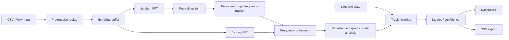

# BLACKSITE v1.0 Architecture

## Design idea

BLACKSITE treats signal detections as persistent objects with history. The main difference is:

**measurement != track identity != display**

A peak is a measurement from one analysis frame. A track is BLACKSITE's persistent identity guess across frames. The dashboard is only the presentation layer for the analysis.

## Logical pipeline



## Analysis timing

Time is defined in seconds and converted to sample sizes from the measured input sample rate:

- short FFT: 1.0s
- long/refinement FFT: 4.0s
- hop: 0.5s
- rolling buffer: 5.0s
- main GUI timer: 500ms

This keeps the analysis duration consistent when the input sample rate changes.

## Track states, spectral states, metrics, and confidence

BLACKSITE does not treat every detected peak as a finished result. A detected frequency first becomes a track, then accumulates history over time. That history is then used to determine lifecycle state, refined spectral state, signal metrics, and an overall confidence score.

### Track lifecycle states

BLACKSITE uses the following lifecycle:

**CANDIDATE → ACTIVE → COASTING → LOST → TERMINATED**

A newly detected frequency starts as a **CANDIDATE**.

A candidate becomes **ACTIVE** after it has been detected at least twice.

For each new frame, a new detection is matched to the nearest unused previous track if its rough frequency is within one short FFT bin (1Hz).

If an ACTIVE track is temporarily not detected:

- 1 or 2 consecutive misses → **COASTING**
- 3 or more consecutive misses → **LOST**

A LOST track can still be reacquired. If a new detection appears within one short FFT bin before the 8 seconds timeout expires, BLACKSITE restores the original track ID and returns it to ACTIVE.

If a LOST track is not reacquired within 8 seconds, it becomes **TERMINATED**.

---

### Rough and refined frequency analysis

BLACKSITE uses two resolutions:

The short FFT has approximately 1Hz bin spacing and provides the main rough frequency used for detection and tracking.

The long FFT has approximately 0.25Hz bin spacing and provides higher resolution frequency detections around each rough track. Refined long FFT peaks are assigned to the nearest rough peak if they fall within three short FFT bins of it.

These refined candidates are accumulated over time and grouped into frequency components.

Each component is then assigned one of three spectral states:

**INDIVIDUAL**, **BLENDED**, or **UNCERTAIN**.

---

### INDIVIDUAL

A refined component is marked **INDIVIDUAL** when there is enough evidence to treat it as a persistent separate spectral component.

For a single refined component, BLACKSITE currently requires:

- at least 2 observations
- persistent appearance across at least 50% of the current analysis time span

When several nearby refined components exist, a component can also be classified as INDIVIDUAL when:

- it has at least 2 observations
- it appears across at least 50% of the current analysis time span
- it appears in at least 2 shared long FFT windows with another component
- the two components are separated by at least 2 long FFT bins
- a measurable valley exists between the peaks
- the median valley ratio is less than or equal to 0.9

The valley ratio is calculated as:

`valley magnitude / magnitude of the weaker of the two peaks`

**A lower ratio means there is a deeper separation between the two spectral peaks.**

---

### BLENDED

A refined component can be marked **BLENDED** when it lies between two components that have already been classified as INDIVIDUAL and the surrounding components have appeared together in at least 2 shared spectral windows.

This is BLACKSITE's way of saying that spectral energy exists in the region, but the component is more likely part of the overlap between two stronger resolved components than a confidently separate source.

---

### UNCERTAIN

**UNCERTAIN** is the default refined spectral state.

A component remains UNCERTAIN when there is not enough persistence, separation, shared window evidence, or valley evidence to classify it as INDIVIDUAL or BLENDED.

BLACKSITE keeps uncertain evidence instead of deleting it, because later observations may provide enough information for a better decision.

---

## Track metrics

BLACKSITE stores measurement history for each track and calculates several metrics for it.

### Rough frequency

The main short FFT frequency associated with the track.

This is the frequency used for the primary tracking process.

### Refined frequencies

Higher resolution long FFT frequency components associated with the rough track.

These are separated into:

- confirmed INDIVIDUAL components
- BLENDED components
- UNCERTAIN components

### Strength

The detected spectral magnitude of the rough frequency peak.

BLACKSITE also keeps the full strength history for each track.

The physical unit of strength depends on the sensor, scaling, and acquisition chain used to produce the input data.

BLACKSITE v1.0 does not include a universal sensor calibration layer.

### SNR

BLACKSITE currently estimates SNR as a linear magnitude ratio:

`peak magnitude / local noise median`

The local noise estimate is taken from up to three neighboring FFT bins below and three neighboring bins above the detected peak, excluding the peak itself.

**The current SNR value is a linear ratio, not decibels.**

For example:

`SNR = 10`

means the peak magnitude is approximately ten times the local median noise magnitude.

### Bandwidth

Bandwidth is estimated using the detected peak's magnitude.

BLACKSITE calculates a cutoff at:

`peak magnitude × 0.707`

which corresponds approximately to the -3 dB amplitude point, or half-power, as power is proportional to amplitude squared.

Starting from the detected peak, BLACKSITE searches downward and upward in frequency until the magnitude falls below this cutoff.

Bandwidth is then:

`upper cutoff frequency - lower cutoff frequency`

If either cutoff cannot be found, bandwidth is left undefined for that observation.

---

## Frequency drift

BLACKSITE calculates both instantaneous and net frequency drift.

Instantaneous frequency drift between two observations is:

`Δfrequency / Δtime`

with units of:

`Hz/s`

Net frequency drift is:

`(latest frequency - first frequency) / (latest time - first time)`

A positive value means the tracked frequency has a net increase.

A negative value means it has a net decrease.

If two adjacent observations have the same timestamp, the instantaneous drift for that interval is stored as undefined due to invalid division.

---

## Strength trend

Strength trend is calculated in the same way as frequency drift.

Instantaneous strength change is:

`Δstrength / Δtime`

Net strength trend is:

`(latest strength - first strength) / (latest time - first time)`

A positive value means the signal has become stronger overall.

A negative value means it has become weaker overall.

---

## Frequency stability

BLACKSITE measures frequency stability using the standard deviation of the track's rough frequency history.

The standard deviation is maintained incrementally from the stored track history to avoid repeatedly rescanning the complete history during every update.

A small frequency standard deviation means the tracked frequency has remained stable over time.

The current confidence model converts this into a 0 to 1 score:

- frequency standard deviation = 0 Hz scores a 1.0
- frequency standard deviation >= 1 Hz scores a 0.0
- values between 0 and 1 Hz decrease linearly

So:

`frequency stability score = 1 - frequency standard deviation`

for values between 0 and 1 Hz.

Because the short FFT uses a 1 second analysis window, the current rough frequency bin spacing is approximately 1Hz, so this threshold is approximately one rough FFT bin.

---

## Strength stability

BLACKSITE also calculates the standard deviation of the track's strength history.

Because absolute magnitude depends on signal level, the confidence system uses relative strength variation rather than raw standard deviation alone:

`relative variation = strength standard deviation / average strength`

The current strength stability score is:

- relative variation <= 0 scores 1.0
- relative variation >= 0.20 scores 0.0
- between 0 and 0.20 → decreases linearly

If the strength varies by around 20% or more relative to its average, the strength stability part contributes 0 to confidence.

---

## Confidence score

BLACKSITE's confidence score is a heuristic track quality score and has **not been calibrated**.

It is **not a probability** and is **not a statistical guarantee**.

The score currently combines five factors:

| Component | Weight |
|---|---:|
| SNR | 35% |
| Frequency stability | 25% |
| Bandwidth | 20% |
| Strength stability | 10% |
| Lifecycle status | 10% |

### SNR score

The current SNR score is:

- SNR <= 1 scores 0.0
- SNR >= 25 scores 1.0
- between 1 and 25 → linear interpolation

Formula:

`(SNR - 1) / (25 - 1)`

### Frequency stability score

- frequency standard deviation <= 0Hz scores 1.0
- frequency standard deviation >= 1Hz scores 0.0
- otherwise → `1 - frequency standard deviation`

### Bandwidth score

- bandwidth <= 2Hz scores 1.0
- bandwidth >= 5Hz scores 0.0
- between 2 and 5Hz → decreases linearly

Formula:

`1 - ((bandwidth - 2) / (5 - 2))`

### Strength-stability score

Using:

`relative variation = strength standard deviation / average strength`

the score is:

- relative variation <= 0 scores 1.0
- relative variation >= 0.20 scores 0.0
- otherwise → `1 - relative variation / 0.20`

### Lifecycle status score

BLACKSITE assigns:

| State | Score |
|---|---:|
| ACTIVE | 1.00 |
| COASTING | 0.50 |
| CANDIDATE | 0.25 |
| LOST | 0.00 |
| TERMINATED | 0.00 |

### Final confidence

The final confidence is a weighted average of every available component:

`confidence = Σ(component score × component weight) / Σ(available weights)`

If one metric is unavailable, BLACKSITE excludes that metric and its weight instead of assigning it a score of zero.

The confidence value is meant to describe how strong and consistent the current track evidence is.

For example, a high confidence track generally has:

- strong local SNR
- stable frequency
- narrow measured bandwidth
- stable strength
- an ACTIVE lifecycle state

A low confidence track may instead have weak SNR, large frequency variation, broad bandwidth, unstable strength, or a degraded lifecycle state.

The score should therefore be interpreted as:

**"The quality and consistency of the track's available evidence"**

instead of:

**"The probability that this signal is real"**

## GUI and runtime architecture

v1.0 uses Matplotlib with a Qt backend. The main processing callback advances replay every 500 ms. Display work is not all performed together inside that callback:

- waveform and spectrum are kept lightweight
- spectrogram frequency rows are reduced with max pooling when needed
- waveform points are reduced while preserving local extrema
- graph and spectrogram refreshes are alternated or deferred through one-shot Qt timers
- click specific background caching lets selected track history redraw without repainting the full dashboard

I added these changes after profiling showed that most of the GUI lag came from rendering rather than preparing the data.

## v1.0 file architecture

The release remains one Python file. This is intentional for my v1.0 freeze.

I plan to split the project up gradually through v1.1-v1.3. The rough target structure is:

```text
blacksite/
├── acquisition/
├── dsp/
├── tracking/
├── metrics/
├── sensors/
├── ui/
├── io/
├── fusion/
├── autonomy/
└── tests/
```
